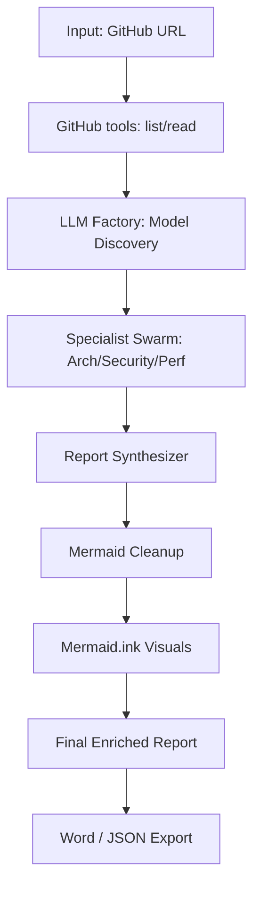
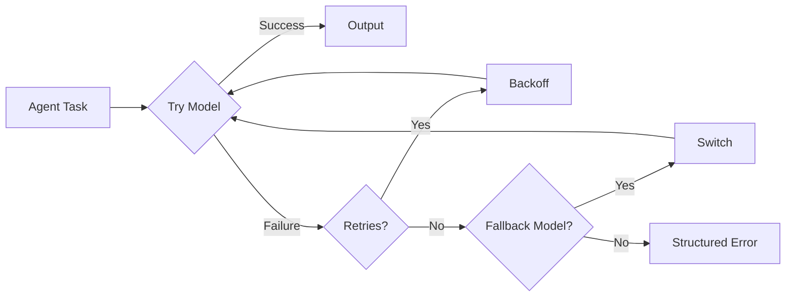

# Architecture Decision Record (ADR): Multi-Agent Architecture Reviewer

## 1. Context and Problem Statement
Single-agent architecture reviews were too broad, less explainable, and sensitive to free-tier model instability. We needed:
- deeper, domain-specific analysis across architecture quality dimensions
- robust operation on free models despite transient provider failures
- detailed, evidence-based reports with implementation-ready recommendations

## 2. Decisions

### 2.1 Multi-Agent Specialist Topology
**Decision:** Transition from a monolithic analysis to a multi-agent system, eventually stabilizing at 6 core specialist agents plus a final synthesizer.

**Rationale:** Domain-specialist prompts improve analysis depth. While we initially started with 12 agents, we consolidated to 6 to reduce API call volume and mitigate free-tier rate limiting.

### 2.7 Agent Consolidation for Resilience (April 2026)
**Decision:** Final consolidation of the "Council of Specialists" into 3 core agents.
- **Architecture, Design & Maintainability**: Tech stacks, patterns, SOLID, technical debt.
- **Security, Quality & Standards**: Vulnerabilities, PII, static typing, coding standards.
- **Performance, Efficiency & QA**: Complexity, bottlenecks, testing maturity, CI/CD.

**Rationale:** 
1. **API Cycle Reduction:** Further minimizes the footprint on free-tier providers to prevent 429 errors.
2. **Cohesive Analysis:** Merges overlapping concerns (e.g., Maintainability with Design) into single-context analysis.

**Trade-off:** Larger prompt context, but extremely high reliability and deeper cross-cutting insights.

### 2.10 External Diagram Rendering via Mermaid.ink (April 2026)
**Decision:** Migrate from local Mermaid.js or Base64 iframes to **Mermaid.ink** for rendering.

**Rationale:** 
1. **Stability**: Avoids JavaScript initialization conflicts in Streamlit's reactive environment.
2. **Consistency**: Works perfectly across both the UI and exported Word documents.
3. **Robustness**: The local `mermaid_cleanup.py` utility ensures LLM-generated syntax errors are corrected before sending to the renderer.

### 2.11 Streamlined Export Formats (April 2026)
**Decision:** Focus exclusively on **Word (.docx)** and **JSON** exports; remove PDF support.

**Rationale:** 
1. **Editability**: Users prefer Word for further customizing results in internal reports.
2. **Reliability**: Word handles the embedding of external images (like Mermaid diagrams) and tables much more natively and robustly than default FPDF-based PDF generation.

### 2.4 Parallel Specialist Execution
**Decision:** Empower users to toggle between parallel and sequential execution of specialists.

**Rationale:** Allows fine-tuning based on API key tier (Paid vs Free).

---

## 3. System Flow

### 3.1 High-Level Pipeline

### 3.2 Reliability Flow

## 4. Tooling and Constraints
- GitHub ingestion with configurable depth.
- Mermaid.ink for stable visualizations.
- `AppTest` for headless UI validation.

## 5. Consequences
### Positive
- Massive reduction in transient failures.
- Highly professional Word document output with embedded diagrams.
- Clean code architecture with clear separation of concerns.

### Negative
- Dependency on external Mermaid.ink (mitigated by raw code view fallback).