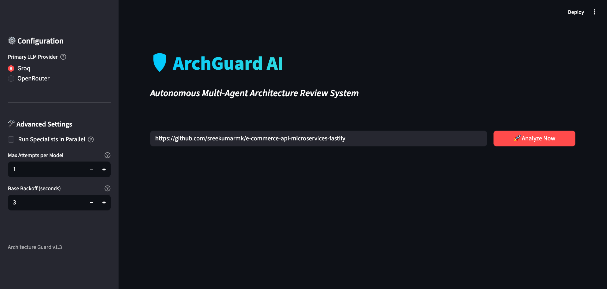
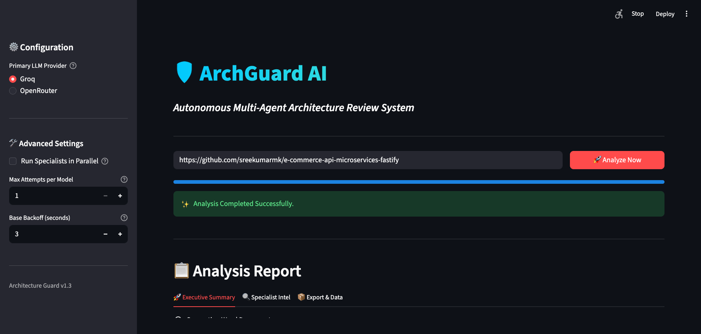
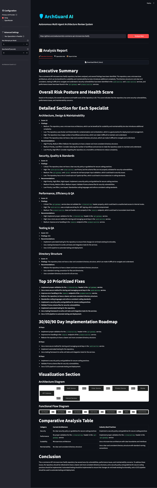
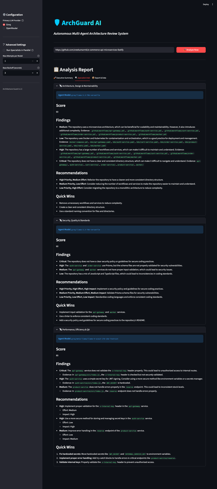
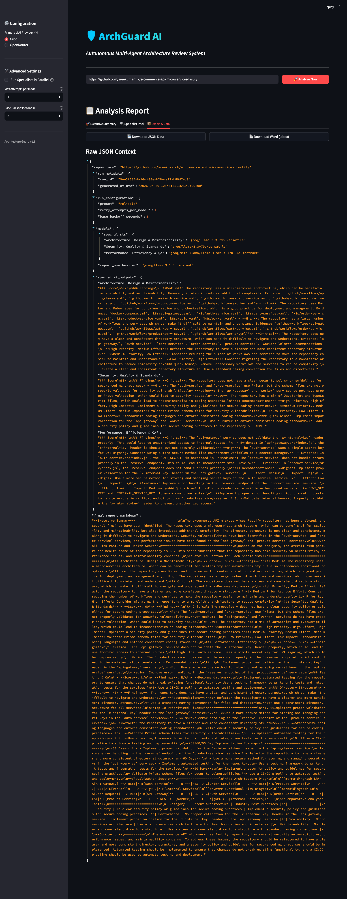
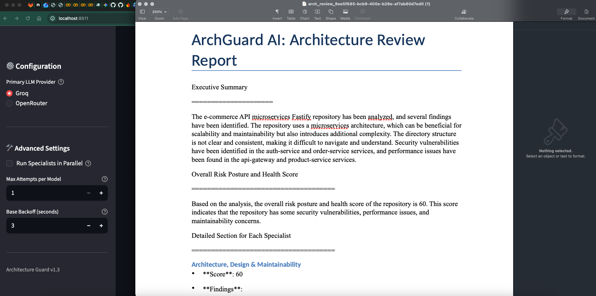
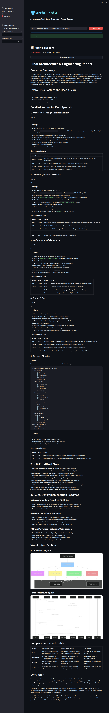
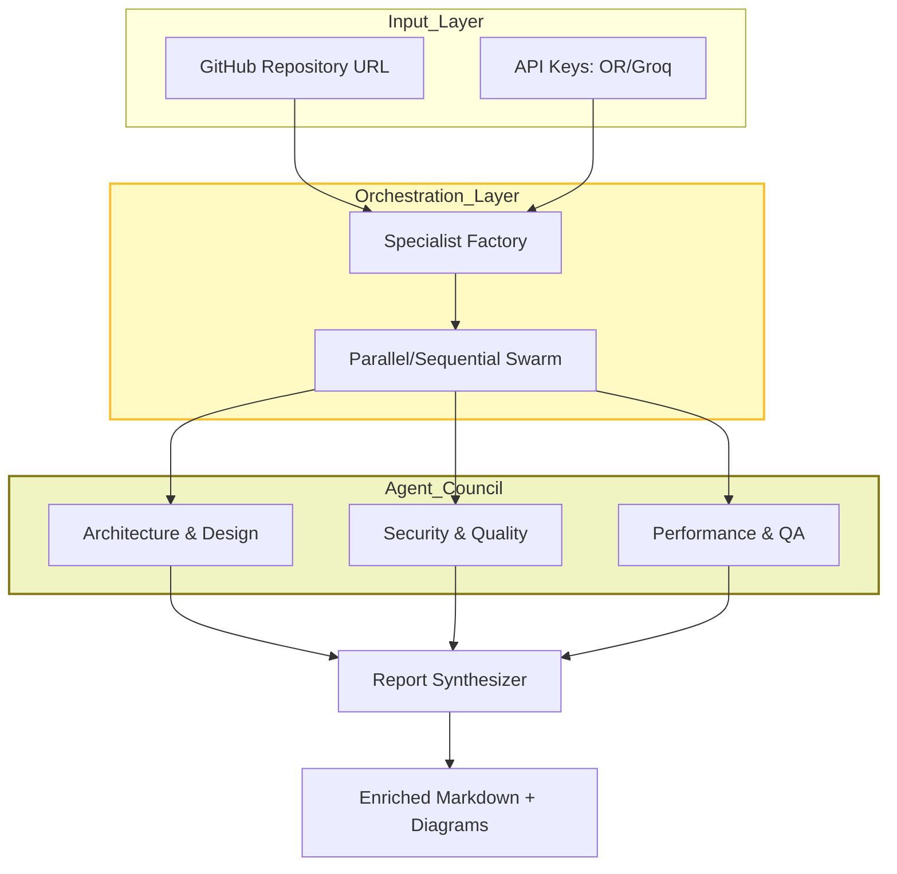
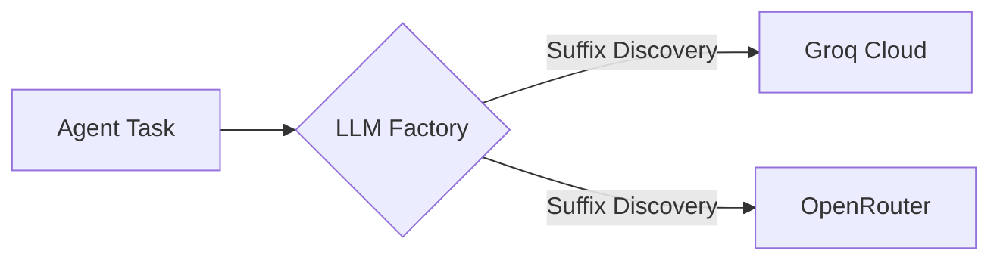

# ArchGuard AI: Agentic Architecture Assistant

**A multi-agent system for deep repository analysis, security auditing, and architectural health assessments using LLMs.**

---

## Project name and problem statement

**Project name:** **ArchGuard AI** (Agentic Architecture Assistant). 

**Problem statement:** Teams spend too much time understanding unfamiliar repositories and judging architectural risk. Single-shot LLM prompts cannot reliably cover a whole codebase, and shallow linting misses cross-cutting concerns (security posture, performance, structural maintainability). Context limits and weak grounding to real files make one-off reviews inconsistent. ArchGuard AI addresses this by orchestrating specialist agents that **list and read real files** from GitHub, score domains, and synthesize an evidence-based engineering report with diagrams and export options.

---

## Team members and their contributions

| Team member | Contribution |
| :--- | :--- |
| **Arjun P Kumar** | Primary implementation and iteration (majority of commits): multi-agent orchestration, Streamlit app, CLI, GitHub tooling, LLM integration, tests, and documentation. *(Includes commits authored as Arjun P K.)* |
| **Sreekumar M K** | Project direction, architecture alignment, and codebase contributions. |

*Summarized from repository git history; update this table if your course or organization needs a different format.*

---

## Tech stack and versions

**Runtime:** Python **3.10+** (CI and local development; the example lock below was produced with Python **3.13**).

**Direct dependencies** (from `requirements.txt`; install with `pip install -r requirements.txt`):

| Package | Example resolved version¹ |
| :--- | :--- |
| streamlit | 1.56.0 |
| langchain | 1.2.15 |
| langchain-openai | 1.1.14 |
| langchain-groq | 1.1.2 |
| langgraph | 1.1.8 |
| python-dotenv | 1.2.2 |
| requests | 2.33.1 |
| pytest | 9.0.3 |
| pytest-cov | (for `pytest --cov`; see `pip freeze`) |
| pytest-dotenv | 0.5.2 |
| python-docx | 1.2.0 |
| fpdf2 | 2.8.7 |
| markdown2 | 2.5.5 |

**Transitive / notable stack** (same environment as above): `langchain-core` 1.3.0, `openai` 2.32.0, `pydantic` 2.13.2, `httpx` 0.28.1, `pillow` 12.2.0, `pandas` 3.0.2, `numpy` 2.4.4.

**External services (no pip version):** [OpenRouter](https://openrouter.ai/), [Groq](https://groq.com/), [GitHub REST API v3](https://docs.github.com/en/rest), [Mermaid.ink](https://mermaid.ink/) (diagram rendering in the UI).

¹ *Example versions from `pip freeze` after `pip install -r requirements.txt`. Your versions may differ; run `pip freeze > requirements.lock.txt` for an exact snapshot.*

**Capability map**

| Layer | Technology |
| :--- | :--- |
| **User interface** | [Streamlit](https://streamlit.io/) |
| **Orchestration** | [LangGraph](https://github.com/langchain-ai/langgraph) and [LangChain](https://www.langchain.com/) |
| **Model gateway** | [OpenRouter](https://openrouter.ai/) and [Groq](https://groq.com/) |
| **Version control** | [GitHub REST API v3](https://docs.github.com/en/rest) |
| **Visualization** | [Mermaid.ink](https://mermaid.ink/) |
| **Testing** | [Pytest](https://pytest.org/) |

---

## Run the project locally (step-by-step)

1. **Install Python**  
   Use Python **3.10** or newer (`python3 --version`).

2. **Clone the repository**  
   ```bash
   git clone <repository-url>
   cd thinkpalm-agentai-sreekumarmk-archguardai
   ```
   *(Adjust the directory name if your clone path differs.)*

3. **Create and activate a virtual environment** (recommended)  
   ```bash
   python3 -m venv .venv
   source .venv/bin/activate          # macOS / Linux
   # .venv\Scripts\activate           # Windows PowerShell
   ```

4. **Install dependencies**  
   ```bash
   pip install --upgrade pip
   pip install -r requirements.txt
   ```

5. **Configure environment variables**  
   ```bash
   cp .env.example .env
   ```
   Edit `.env` and set at least one LLM provider key, for example:  
   `OPENROUTER_API_KEY`, and/or `GROQ_API_KEY`, optional `GITHUB_TOKEN` (higher rate limits), and `DEFAULT_LLM_PROVIDER` (`openrouter` or `groq`).

6. **Run the Streamlit dashboard**  
   From the **repository root** (so `src` imports resolve):  
   ```bash
   streamlit run src/app.py
   ```
   Open the URL shown in the terminal (default `http://localhost:8501`).

7. **Use the app**  
   Enter a public (or token-accessible) **GitHub repository URL**, adjust sidebar options if needed, then click **Analyze Now**.

8. **Optional: run a headless analysis (CLI)**  
   From the repository root:  
   ```bash
   python src/cli.py --repo-url "https://github.com/owner/repo"
   ```
   Defaults mirror **`src/app.py`** and the Streamlit sidebar (see **`src/config/settings.py`** and `.env`). Full flag list: `python src/cli.py --help`.

### CLI reference (`src/cli.py`)

**Outputs (default)** — With default **`--output-prefix`**, the CLI writes three files under **`outputs/`** (the directory is created if needed):

| File | Description |
| :--- | :--- |
| `outputs/multi_agent_report.md` | Final synthesized markdown report. |
| `outputs/multi_agent_report.json` | Structured run payload (repository, `run_metadata`, `run_configuration`, models, specialist outputs, full markdown). |
| `outputs/multi_agent_report.docx` | Word document from **`export_to_docx`** — same pipeline as the Streamlit **Download Word** button. If Word generation fails, a warning is printed to **stderr**; markdown and JSON are still saved. |

**Flags**

| Flag | Description |
| :--- | :--- |
| `--repo-url` | **Required.** GitHub repository URL to analyze. |
| `--provider` `groq` \| `openrouter` | Primary LLM provider for model discovery (default: **`DEFAULT_LLM_PROVIDER`** in `.env`). |
| `--parallel` | Force parallel specialist execution (overrides **`RUN_SPECIALISTS_IN_PARALLEL`**). |
| `--sequential` | Force sequential execution. Mutually exclusive with `--parallel`; if neither is set, the env default applies. |
| `--workers` | Max parallel workers when parallel (default **3**, same as the app sidebar; range **1–10**). |
| `--max-attempts-per-model` | Retries per model before fallback (default **`MAX_ATTEMPTS_PER_MODEL`**; range **1–5**). |
| `--backoff` | Base backoff seconds between retries (default **`BASE_BACKOFF_SECONDS`**; range **1–60**). |
| `--preset` | Label stored in JSON `run_configuration.preset` (default **`Reliable`**, matches the app). |
| `--no-auto-models` | Disable live model discovery; use **`--manual-model`** or a provider-specific default (`groq/…` / `openrouter/…`). |
| `--manual-model` | Single model id with `groq/` or `openrouter/` prefix (used with **`--no-auto-models`**). |
| `--memory-db` | Path to the SQLite memory database (default **`MEMORY_DB_PATH`**: **`ARCHGUARD_MEMORY_DB`** env or **`.archguard_memory.db`** at the repo root — shared with Streamlit when the path matches). |
| `--output-prefix` | Path prefix without extension (default **`outputs/multi_agent_report`**). Example: `outputs/sprint2` or `reports/acme`. |

**Examples**

```bash
python src/cli.py --repo-url "https://github.com/owner/repo" --provider openrouter --sequential
python src/cli.py --repo-url "https://github.com/owner/repo" --parallel --workers 3
python src/cli.py --repo-url "https://github.com/owner/repo" --output-prefix "outputs/nightly"
```

### Changing models from the CLI

1. **Switch provider (auto discovery still on)**  
   Use **`--provider groq`** or **`--provider openrouter`** so candidate lists and fallbacks come from that provider. If you omit **`--provider`**, the CLI uses **`DEFAULT_LLM_PROVIDER`** from `.env`.  
   The **order** of models in auto mode still comes from **`.env`** (for example `GROQ_FREE_MODELS`, `GROQ_ARCHITECT_DESIGN`, `OPENROUTER_REPORT_SYNTHESIZER`, etc. — see **`.env.example`**).

   ```bash
   python src/cli.py --repo-url "https://github.com/owner/repo" --provider groq
   python src/cli.py --repo-url "https://github.com/owner/repo" --provider openrouter
   ```

2. **Pin one model for the entire run (no discovery)**  
   Pass **`--no-auto-models`** and **`--manual-model`** with a full id including the prefix expected by **`get_llm`**: **`groq/...`** or **`openrouter/...`**. Specialists and the synthesizer all use that single model (with retries / fallback only if the same id is retried per your **`--max-attempts-per-model`** settings).

   ```bash
   python src/cli.py --repo-url "https://github.com/owner/repo" \
     --no-auto-models \
     --manual-model "groq/llama-3.3-70b-versatile"

   python src/cli.py --repo-url "https://github.com/owner/repo" \
     --no-auto-models \
     --manual-model "openrouter/openai/gpt-oss-120b:free"
   ```

   If you use **`--no-auto-models`** without **`--manual-model`**, the CLI uses a **built-in default** for the active provider (`groq/llama-3.3-70b-versatile` vs `openrouter/openai/gpt-oss-120b:free`), based on **`--provider`** or **`DEFAULT_LLM_PROVIDER`**.

3. **Tune models without CLI flags (auto mode)**  
   Edit **`.env`** to change preference lists and fallbacks (e.g. `GROQ_FREE_MODELS`, per-agent `GROQ_*` / `OPENROUTER_*` variables). Those apply when you **do not** pass **`--no-auto-models`**.

### Retries and backoff (CLI vs `src/app.py`)

In **Streamlit**, **Max Attempts per Model** and **Base Backoff (seconds)** come from the sidebar; their **initial values** are read from **`MAX_ATTEMPTS_PER_MODEL`** and **`BASE_BACKOFF_SECONDS`** in **`src/config/settings.py`** (overridable via **`.env`**).

The **CLI** uses the same pipeline: **`--max-attempts-per-model`** and **`--backoff`** are passed into **`SpecialistFactory.run_agent_with_retries`** and **`synthesize_report`**, just like **`app.py`** uses `config["max_attempts_per_model"]` and `config["base_backoff_seconds"]`. Allowed ranges match the UI (**1–5** attempts, **1–60** seconds backoff).

**Option A — Match the app’s default env (no CLI flags)**  
Set in **`.env`** (same variables the sidebar starts from):

```bash
MAX_ATTEMPTS_PER_MODEL=1
BASE_BACKOFF_SECONDS=3
```

Then run:

```bash
python src/cli.py --repo-url "https://github.com/owner/repo"
```

**Option B — Match specific sidebar numbers (explicit flags)**  
Example: 3 attempts per model, 5 seconds base backoff:

```bash
python src/cli.py --repo-url "https://github.com/owner/repo" \
  --max-attempts-per-model 3 \
  --backoff 5
```

If you omit **`--max-attempts-per-model`** or **`--backoff`**, the CLI uses **`MAX_ATTEMPTS_PER_MODEL`** and **`BASE_BACKOFF_SECONDS`** from settings — equivalent to opening the app with the sidebar at its default positions.

9. **Optional: run tests**  
   ```bash
   python -m pytest tests/ -v
   ```

---

## Working prototype (screenshots)

Screenshots below are stored under [`screenshots/`](screenshots/).

| Step | Screenshot |
| :---: | :---: |
| Initial dashboard |  |
| Specialist agent 1 (in progress) |  |
| Specialist agent 2 (in progress) |  |
| Specialist agent 3 (in progress) |  |
| Analysis completed |  |
| Full-page report (Groq example) |  |
| Specialist intelligence section |  |
| Export data UI |  |
| Document download |  |
| Full-page report (OpenRouter example) |  |

---

## Overview

ArchGuard AI orchestrates a **Council of Specialists** so reviews go beyond simple linting: evidence-based insights into tech stack maturity, security posture, design integrity, and performance efficiency.

Specialists use a **ReAct-style** loop (list repository files, read selected paths, analyze) backed by **LangChain** tool agents. A **report synthesizer** merges outputs into a single roadmap-style report. **LangGraph** is included for reporter graph compilation; the live Streamlit and CLI flows are driven by the specialist factory and synthesizer described in the project layout below.

---

## Key features

- **Council of specialists:** three domain agents (Architecture/Design, Security/Quality, Performance/Testing) plus synthesis.
- **Evidence-based findings:** findings tied to files fetched via GitHub tools.
- **LLM adapter layer:** OpenRouter and Groq with dynamic model discovery and fallbacks.
- **Parallel execution swarm:** optional parallel specialist runs (Streamlit sidebar / CLI flags).
- **Visual reporting:** Mermaid in reports, cleaned and rendered via **Mermaid.ink** in Streamlit.
- **Runtime resilience:** retries, backoff, and model fallback chains.
- **CLI and UI:** Streamlit dashboard and **`src/cli.py`** for headless runs (markdown, JSON, and Word under **`outputs/`** by default).

---

## System architecture

The **LLM adapter layer** routes to OpenRouter or Groq. The **Specialist Factory** runs the council, then the **report synthesizer** produces enriched markdown and diagrams.



---

## Functional flow

### 1. Model discovery and routing

Provider model lists are queried; routing uses model naming and configuration (for example `groq/` vs OpenRouter-style ids).



### 2. Specialist investigation (ReAct pattern)

- **Observation:** review the file tree.  
- **Action:** call `read_specific_file` for evidence.  
- **Thinking:** analyze against domain prompts.  
- **Scoring:** numeric score 0–100 in the specialist output template.

### 3. Resilience and fallback

On failure: retry with backoff, then try the next model in the candidate chain.

### 4. Synthesis and rendering

The synthesizer builds the final narrative and Mermaid blocks; the UI sanitizes Mermaid and renders images via **Mermaid.ink**.

---

## Project structure

```text
.
├── src/
│   ├── agents/
│   │   ├── specialists/
│   │   │   ├── factory.py      # Specialist runner with swarm logic
│   │   │   ├── base.py         # Base ReAct agent core
│   │   │   ├── architect.py    # Arch, Design & Maintainability
│   │   │   ├── security.py     # Security, Quality & Standards
│   │   │   └── performance.py  # Performance, Efficiency & QA
│   │   └── synthesizer.py      # Final report aggregator
│   ├── config/
│   │   └── settings.py         # Centralised settings & constants
│   ├── memory/
│   │   └── manager.py          # Session-state memory persistence
│   ├── tools/
│   │   └── github.py           # GitHub REST API connectors
│   ├── ui/
│   │   └── components.py       # Sidebar & Export UI widgets
│   ├── utils/
│   │   ├── export.py           # Word (.docx) export logic
│   │   ├── llm_factory.py      # Provider-agnostic adapter
│   │   ├── models.py           # Dynamic model discovery
│   │   ├── rendering.py        # Enriched report display
│   │   └── mermaid_cleanup.py  # Mermaid syntax sanitization
│   └── app.py                  # Streamlit Application
├── outputs/                    # CLI-generated .md / .json / .docx (gitignored)
├── screenshots/                # Prototype screenshots (see above)
├── tests/                      # Unit, CLI E2E, Streamlit UI E2E
├── ADR.md                      # Architecture Decision Records
└── .env.example                # Configuration template
```

### Key components

- **`src/agents/specialists/factory.py`:** parallel swarms, model fallback, retries.  
- **`src/utils/llm_factory.py`:** Groq / OpenRouter routing.  
- **`src/utils/mermaid_cleanup.py`:** diagram sanitization.  
- **`src/app.py`:** Streamlit entrypoint.  
- **`src/cli.py`:** headless pipeline aligned with the app — SQLite memory, provider / parallel / retry flags, JSON metadata, and **`export_to_docx`** Word export to **`outputs/`** (configurable via `--output-prefix`).

---

## Usage (Streamlit)

1. Enter a **GitHub repository URL**.  
2. Use the **sidebar** for provider, parallel vs sequential execution, and retry settings.  
3. Click **Analyze Now**.  
4. Review the report and diagrams.  
5. **Export** Word or JSON where offered in the UI.

---

## Testing and validation

The suite includes unit tests, CLI E2E, and Streamlit `AppTest` flows (see `tests/`). **`pytest.ini`** sets **`pythonpath = .`** so `import src…` works from any working directory (including when your IDE runs a single test file). Use **pytest 7+**.

```bash
python3 -m pytest tests/ -v
python3 -m pytest tests/unit/ -v
```

Coverage (requires **`pytest-cov`**, listed in **`requirements.txt`** — run `pip install -r requirements.txt` first):

```bash
python -m pytest --cov=src --cov-report=term-missing tests/
python -m pytest --cov=src --cov-report=html tests/
```

If you see **`error: unrecognized arguments: --cov=src`**, install the missing plugin: `pip install pytest-cov`.

### UI E2E pattern (excerpt)

```python
from streamlit.testing.v1 import AppTest

at = AppTest.from_file("src/app.py", default_timeout=30).run()
assert len(at.exception) == 0
at.sidebar.radio[0].set_value("OpenRouter").run()
assert at.session_state.llm_provider == "OpenRouter"
```

---

## Contributing

Contributions are welcome. Read [ADR.md](ADR.md) for design context before opening a PR.

---

## License

MIT License — Copyright (c) 2026 ArchGuard AI Team.
