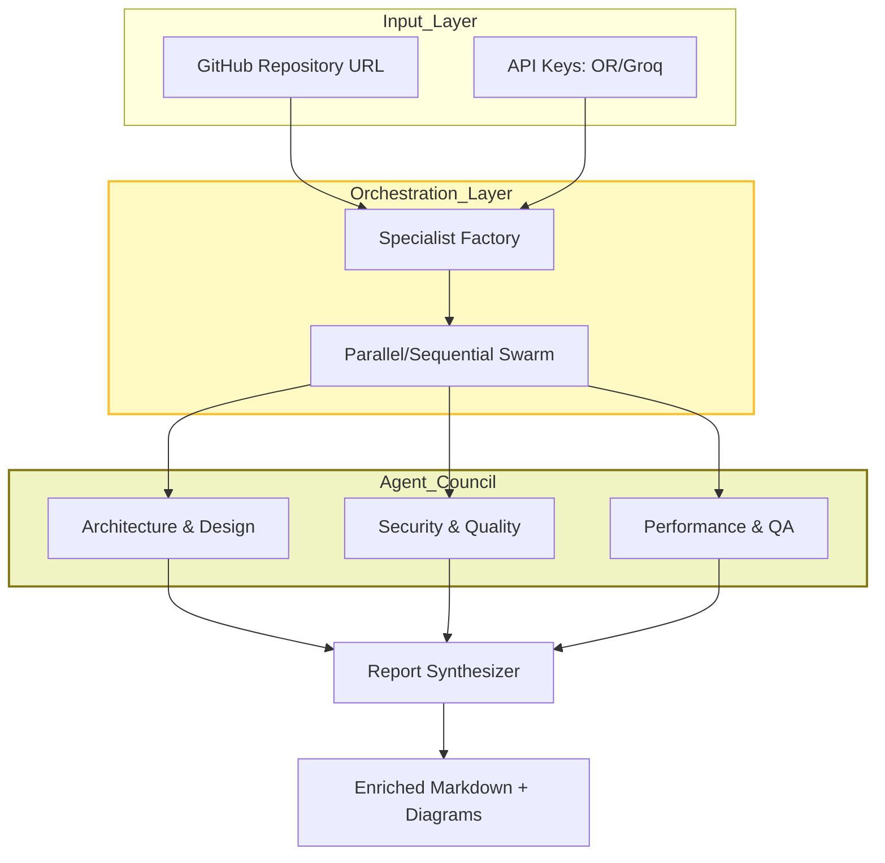
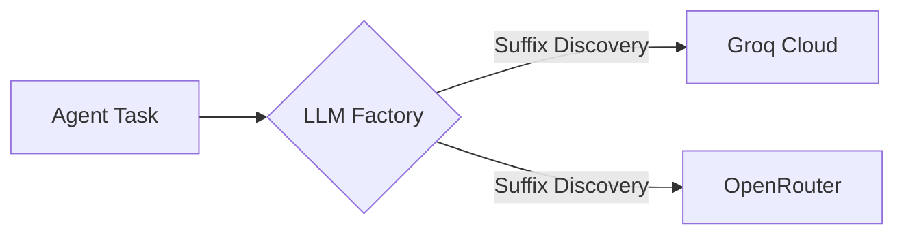

# 🏗️ ArchGuard AI: Agentic Architecture Assistant

**A sophisticated multi-agent system designed to perform deep repository analysis, security auditing, and architectural health assessments using state-of-the-art LLMs.**

---

## 🌟 Overview

ArchGuard AI is a powerful, production-ready tool that transforms how engineering teams review codebases. By orchestrating a "Council of Specialists," it goes beyond simple linting to provide deep, evidence-based insights into tech stack maturity, security posture, design integrity, and performance efficiency.

Built with **LangGraph**, it utilizes a robust **ReAct (Reasoning and Acting)** pattern to allow agents to interact directly with your GitHub repository, fetch specific files, and build a comprehensive understanding of the architecture before synthesizing a final, prioritized engineering roadmap.

---

## 🚀 Key Features

- **Council of Specialists**: 3 converged domain-specific agents focused on Architecture/Design, Security/Quality, and Performance/Testing.
- **Evidence-Based Findings**: Every finding is backed by direct evidence fetched from the repository using automated tools.
- **LLM Adapter Layer**: Unified interface for seamlessly switching between **OpenRouter** and **Groq**.
- **Dynamic Intelligence**: Dynamically discovers available models (Gemma, Qwen, Llama, Mixtral) from both providers.
- **Parallel Execution Swarm**: Configurable parallel or sequential execution of agents for maximum efficiency.
- **Visual Excellence**: Automatic cleanup and rendering of Mermaid.js diagrams using **Mermaid.ink** for consistent visuals.
- **Runtime Resilience**: Intelligent retries, exponential backoff, and model fallback chains.
- **CLI & UI Support**: Professional Streamlit web interface and a robust CLI for CI/CD.

---

## 🛠️ Tech Stack

| Layer | Technology |
| :--- | :--- |
| **User Interface** | [Streamlit](https://streamlit.io/) |
| **Orchestration** | [LangGraph](https://github.com/langchain-ai/langgraph) & [LangChain](https://www.langchain.com/) |
| **Model Gateway** | [OpenRouter](https://openrouter.ai/) & [Groq](https://groq.com/) |
| **Version Control** | [GitHub REST API v3](https://docs.github.com/en/rest) |
| **Logic/Runtime** | Python 3.10+ |
| **Visualization** | [Mermaid.ink](https://mermaid.ink/) |
| **Testing** | [Pytest](https://pytest.org/) |

---

## 📐 System Architecture

### Multi-Agent Pipeline
The system utilizes a unified **LLM Adapter Layer** to route requests to either OpenRouter or Groq. The **Specialist Factory** orchestrates the "Council of Specialists".



---

## 🔄 Functional Flow

### 1. Model Discovery & Routing
The process begins by fetching the latest model availability from providers. Requests are routed based on prefix (e.g., `groq/` or `openrouter/`).



### 2. Specialist Investigation (ReAct Pattern)
Each specialist agent follows a **Reasoning + Action** loop:
- **Observation**: Reviews the file tree to identify high-interest files.
- **Action**: Uses the `read_specific_file` tool to fetch source code.
- **Thinking**: Analyzes evidence against domain-specific principles.
- **Scoring**: Assigns a numeric score (0-100).

### 3. Resilience & Fallback
If a model fails, the system automatically:
1.  **Retries** with exponential backoff.
2.  **Switches** to the next best model in the fallback chain.

### 4. Synthesis & Rendering
The Report Synthesizer builds a narrative and generates Mermaid code. The rendering utility cleans the code and fetches stable image visuals from **Mermaid.ink**.

---

## 📁 Project Structure

```text
.
├── src/
│   ├── agents/
│   │   ├── specialists/
│   │   │   ├── factory.py      # Specialist runner with swarm logic
│   │   │   ├── base.py         # Base ReAct agent core
│   │   │   ├── architect.py    # Arch, Design & Maintainability
│   │   │   ├── security.py     # Security, Quality & Standards
│   │   │   └── performance.py  # Performance, Efficiency & QA
│   │   └── synthesizer.py      # Final report aggregator
│   ├── config/
│   │   └── settings.py         # Centralised settings & constants
│   ├── memory/
│   │   └── manager.py          # Session-state memory persistence
│   ├── tools/
│   │   └── github.py           # GitHub REST API connectors
│   ├── ui/
│   │   └── components.py       # Sidebar & Export UI widgets
│   ├── utils/
│   │   ├── export.py           # Word (.docx) export logic
│   │   ├── llm_factory.py      # Provider-agnostic adapter
│   │   ├── models.py           # Dynamic model discovery
│   │   ├── rendering.py        # Enriched report display
│   │   └── mermaid_cleanup.py  # Mermaid syntax sanitization
│   └── app.py                  # Streamlit Application
├── tests/                      # 53 Tests: 100% Passing
├── ADR.md                      # Architecture Decision Records
└── .env.example                # Configuration template
```

### Key Components
- **`src/agents/specialists/factory.py`**: Specialist orchestration engine—handles parallel swarms, model fallback, and retry logic.
- **`src/utils/llm_factory.py`**: Multi-provider adapter—routes requests to Groq or OpenRouter with zero-config dynamic discovery.
- **`src/utils/mermaid_cleanup.py`**: Diagram sanitizer—corrects LLM-generated Mermaid syntax for stable rendering.
- **`src/app.py`**: Streamlit dashboard—integrates memory management, agent swarms, and visual reporting.
- **`src/cli.py`**: Headless CLI—automates analysis for CI/CD pipelines.

---

## 🛠️ Installation & Setup

### Prerequisites
- Python 3.10 or higher
- [OpenRouter API Key](https://openrouter.ai/keys)
- [GitHub Personal Access Token](https://github.com/settings/tokens) (Optional but recommended for higher rate limits)

### Step 1: Clone & Install
```bash
git clone <repository-url>
cd archguard-ai
pip install -r requirements.txt
```

### Step 2: Configure Environment
Copy the example environment file and fill in your keys:
```bash
cp .env.example .env
```

Edit `.env`:
```bash
OPENROUTER_API_KEY=your_openrouter_key
GROQ_API_KEY=your_groq_key
GITHUB_TOKEN=your_github_token
DEFAULT_LLM_PROVIDER=openrouter
```

### Step 3: Run the Dashboard
```bash
streamlit run src/app.py
```

---

## 📖 Usage Guide

1.  **Input**: Enter a GitHub Repository URL.
2.  **Configure**: Use the sidebar to toggle **Parallel Execution** for speed or Sequential for higher stability.
3.  **Run**: Click "Analyze Now".
4.  **Visualize**: Interact with the high-fidelity report and automated diagrams.
5.  **Export**: Download the **Word Document** for reporting or **JSON** for data integration.

---

## 🧪 Testing & Validation

ArchGuard AI ships a **comprehensive, multi-layer test suite** — 53 tests covering every module across unit, CLI E2E, and Streamlit UI E2E layers.

### Test Matrix

| Layer | File | Scope |
| :--- | :--- | :--- |
| **Unit** | `test_specialist.py` | Agent prompt building, retry logic, rate-limit backoff |
| **Unit** | `test_synthesizer.py` | Report synthesis, retry & fallback |
| **Unit** | `test_llm_factory.py` | Groq / OpenRouter routing by model prefix |
| **Unit** | `test_models.py` | Free-model discovery, candidate ranking, provider selection |
| **Unit** | `test_github.py` | URL parsing, file tree fetching, base64 decoding |
| **Unit** | `test_memory_manager.py` | Session-state init, context building, memory capping |
| **Unit** | `test_rendering.py` | Mermaid local/CDN rendering, enriched report display |
| **Unit** | `test_reporter.py` | LangGraph `StateGraph` compilation |
| **Unit** | `test_schemas.py` | Pydantic model validation (`AgentSpec`, `FinalReport`, …) |
| **Unit** | `test_export.py` | Word & PDF generation, character sanitisation |
| **Unit** | `test_ui_components.py` | `build_json_export`, sidebar state, export downloads |
| **E2E CLI** | `test_cli_e2e.py` | Full pipeline: memory load/save, analysis, file outputs |
| **E2E UI** | `test_ui_e2e.py` | Streamlit app: page load, sidebar config, input validation, report tabs, session state |

### Running Tests

```bash
# Full suite
python3 -m pytest tests/ -v

# Unit tests only
python3 -m pytest tests/unit/ -v
```

### Generating Coverage Reports

```bash
# Terminal summary (shows uncovered lines)
python -m pytest --cov=src --cov-report=term-missing tests/

# Interactive HTML report (open htmlcov/index.html)
python -m pytest --cov=src --cov-report=html tests/

# Run only fast tests, skip analysis flow
python -m pytest tests/ -k "not TestAnalysisFlow" -v
```

### UI E2E Testing — How It Works

Streamlit UI tests use **`streamlit.testing.v1.AppTest`** — Streamlit's first-party headless test runner. It simulates the full app execution without a browser, allowing interaction with widgets programmatically:

```python
from streamlit.testing.v1 import AppTest

at = AppTest.from_file("src/app.py").run()
assert len(at.exception) == 0                        # no crash on load
at.sidebar.radio[0].set_value("Groq").run()         # switch provider
assert at.sidebar.selectbox[0].options[0].startswith("groq/")  # correct models shown
```

Post-analysis UI is tested via `AppTest.from_function` with a self-contained page function, avoiding the `ThreadPoolExecutor` patching limitation inherent to `from_file` isolation.

---

## 📸 Visual Gallery

Explore the ArchGuard AI interface and its detailed reporting capabilities:

| **Main Dashboard** | **Analysis Progress** |
| :---: | :---: |
|  |  |
| *Enter GitHub URL and configure settings* | *Real-time specialist agent feedback* |

| **Architectural Visualizations** | **Risk Hotspots** |
| :---: | :---: |
|  |  |
| *Automated Mermaid diagrams of current state* | *Evidence-based risk mapping* |

---

## 👨‍💻 Contributing
We welcome contributions! Please see our [ADR.md](docs/ADR.md) to understand the design philosophy before submitting a PR.

## 📄 License
MIT License - Copyright (c) 2026 ArchGuard AI Team.